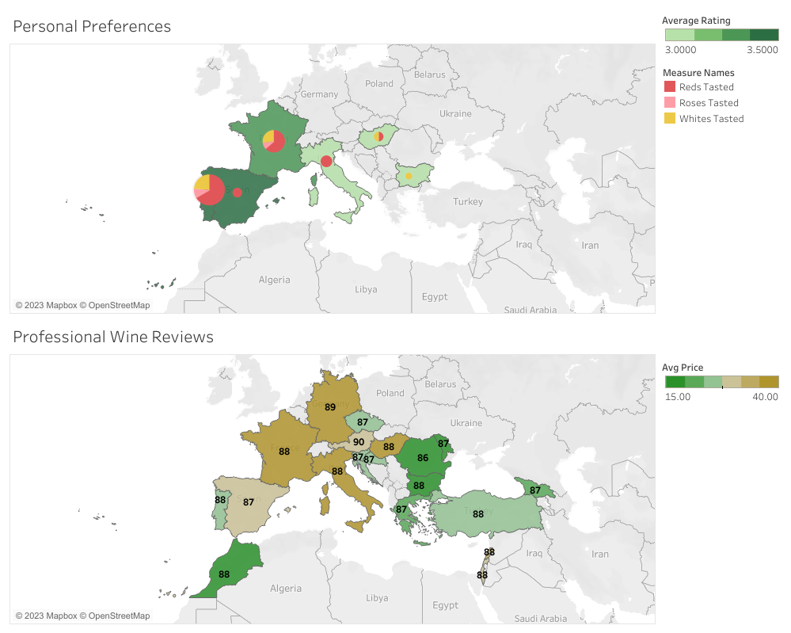

```{r setup, include=FALSE}
knitr::opts_chunk$set(echo = TRUE)
```
```{r, message=FALSE, warning=FALSE}
install.packages(c("tidyverse","SimDesign","janitor","plyr"))
library(plyr)
library(tidyverse)
library(SimDesign)
library(ggplot2)
library(janitor)
library(data.table)
```

## A Case Study

This is an R Markdown document summarizing my work for the Google Data Analytics Certificate case study.

Scenario: You are a junior data analyst working for a business intelligence consultant. You have been at your job for six months, and your boss feels you are ready for more responsibility. He has asked you to lead a project for a brand new client — this will involve everything from defining the business task all the way through presenting your data-driven recommendations. You will choose the topic, ask the right questions, identify a fresh dataset and ensure its integrity, conduct analysis, create compelling data visualizations, and prepare a presentation.

### Business Task
Business Task: I want to determine if I should expand my knowledge of wines to a new geographic region, and if so then what region should be my top priority.

* Stakeholders: Duncan and his wife Chelsea
* Key factors: personal wine preferences and global wine production quality
* Data: personal wine journal with records of wines tasted over the course of 3 years, plus professional wine reviews

I should first determine which regions I have already explored in depth and which prospective regions I have had the most success with. I should consider both professional opinions and my own personal preferences when identifying the best regions to suggest for further expansion. 

### Preparing the data
* I digitized my personal wine journal as a .csv file
* Professional wine reviews were taken from two major wine magazines:
  + <https://s3.amazonaws.com/assets.mshanken.com/wso/bolt/media/vintcardweb010122.pdf>
  + <https://www.kaggle.com/datasets/zynicide/wine-reviews?resource=download>

I have 245 entries from Wine Spectator magazine and I kept 109,121 entries from the Wine Magazine reviews. Some data was corrupted from the source, but what I was able to keep should be sufficient for this analysis.
Data was uploaded onto Google BigQuery.

Does this data ROCC?
* Reliable: My wine journal is the most reliable possible source of my wine preferences (and those of my wife!). The professional notes are industry standard for reliable views of wine quality.
* Original: The wine journal data is original. Wine Spectator data is not original, but the code used to scrape it from the web is provided so at least it is repeatable. The Wine Magazine data is original from the magazine.
* Comprehensive: The size of the external data sets as well as the original nature of the wine journal suggests that this data will be enough to answer the question at hand.
* Current: wine data moves slowly, so this data is sufficiently up to date (within a few years)
* Cited: the sources are linked above

### Data processing
I processed my wine journal in Google Spreadsheets because it was convenient for this dataset with just over 100 entries. The sheet can be viewed [here.](https://docs.google.com/spreadsheets/d/1IabvtaUuWUGPTo6RqFUAMdJ_kizZUThkhUFj8H5MRbM/edit?usp=sharing)

**Spreadsheet Validation steps**

To ensure that data is entered correctly, I made the `Rating` and `Color` columns into drop down menus so that invalid entries are rejected. I also color-coded the `Color` columns to provide a visual aid to the user (me) when entering data. I also performed basic numeric formatting for the `Vintage` and `Date` columns to ensure consistent formatting.

I then did some basic transformations of the data using a pivot table with conditional formatting, both to verify that the data is as I expect it to be and because the summary statistics I computed (average personal wine rating by country and color) will be useful during the subsequent analysis.

**SQL Validation steps**

For the professional wine reviews, I checked the data types in the schema on Google BigQuery to ensure that all data was correctly identified during the automatic upload. For the Wine Spectator scores, the score was identified as a String type, where it should be an Integer type. I noted that this will need to by typecast during calculations later in the analysis.

I also did some basic SQL queries to check that my data was consistent throughout each table. One important example was when I ran the query below:
```
SELECT 
  DISTINCT score
FROM
  wines.wine_spectator_scores
ORDER BY score
```
I found out that I had entered a range of scores for one region in my table. I used SQL to clean the table:
```
UPDATE
  wines.wine_spectator_scores
SET country = "Argentina", region_or_type = "Red", vintage = 2019, score = 91, drinkability = "NYR"
WHERE
  score = "91-94"
```

For the Wine Spectator table I found that I had quite a few entries with null values for the points field. These observations will not be useful for my analysis, but I will filter them during my SQL commands in the analysis phase (just to demonstrate a variety of approaches).

I also noticed that the United States is given by "US" in the Wine Magazine data set but given by "USA" in the Wine Spectator data set. I fixed this with a simple Find & Replace in the Wine Spectator data set because it was quick and easy to do in a spreadsheet for this comparatively small file.

### Data Analysis
As mentioned above, I computed a pivot table of my wine journal entries in Google Spreadsheets.
[This analysis](https://docs.google.com/spreadsheets/d/1IabvtaUuWUGPTo6RqFUAMdJ_kizZUThkhUFj8H5MRbM/edit#gid=1160162212&range=A1:E16) revealed several insights:

* I really enjoy wines from Portugal!
* I have also enjoyed red wines from Spain, which has some similar terroir to Portugal.
* I have had very good experience with French white wines. This surprised me, as I previously had the impression (gut instinct here, no data!) that I wanted to explore French *red* wines.

I created some summary statistics from my wine journal using the following SQL query:
```
SELECT
  Country,
  AVG(Rating) AS Average_Rating,
  COUNTIF(Color="Red") AS Reds_Tasted,
  COUNTIF(Color="White") AS Whites_Tasted,
  COUNTIF(Color="Rose") AS Roses_Tasted,
FROM
  `silver-retina-374023.wines.wine_journal`
GROUP BY
  Country

```
I'll use the returned data table to visualize my personal preferences in the next phase.

Now I want to compare my preferences with global analyses of major wine regions, to see if I am missing important geographic areas which I might be missing entirely.

The first SQL query I ran was to aggregate the Wine Magazine reviews by country. I limited my search to countries where at least 10 reviews exist in the data set because I want to make sure I will be able to find the wines in my local wine store, and I doubt I'll be able to find a wine so rare that only 1 review exists out of more than 100,000 reviews! The query I used was:
```
SELECT
  country, AVG(points) AS avg_points, AVG(price) AS avg_price
FROM
  wines.winemag_reviews
WHERE
  points > 80 AND country IS NOT null and price IS NOT null
GROUP BY
  country
HAVING
  COUNT(country) > 10
ORDER BY
  country
```

A similar query returns the aggregate data for the Wine Spectator data set.
Here, there is no price data, and I have to typecast the score (noted during the data processing phase).
```
SELECT
  country, AVG(CAST(score AS INT64)) AS avg_points
FROM
  wines.wine_spectator_scores
WHERE
  CAST(score AS INT64) > 80 AND country IS NOT null
GROUP BY
  country
ORDER BY
  country
```

To combine the two professional wine review data sets I used another SQL query:
```
SELECT
  winemag_data.country, winespec_data.avg_points, winemag_data.avg_price
FROM
-- Subquery aggregates winemag data set
  (
  SELECT
    country, AVG(points) AS avg_points, AVG(price) AS avg_price
  FROM
    wines.winemag_reviews
  WHERE
    points > 80 AND country IS NOT null and price IS NOT null
  GROUP BY
    country
  HAVING
    COUNT(country) > 10
  ) AS winemag_data
INNER JOIN
-- Subquery aggregates winespec data set
  (
  SELECT
    country, AVG(CAST(score AS INT64)) AS avg_points
  FROM
    wines.wine_spectator_scores
  WHERE
    CAST(score AS INT64) > 80 AND country IS NOT null
  GROUP BY
    country
  ) AS winespec_data
ON winemag_data.country = winespec_data.country
ORDER BY
  country
```

Let's use R to check how well the scores from these two external data sets are correlated.
```{r}
winemag_aggregate_data <- read.csv("winemag_aggregate_data.csv")
winespec_aggregate_data <- read.csv("winespec_aggregate_data.csv")

# Clean winespec data set to have United States match winemag data set
winespec_aggregate_data[winespec_aggregate_data == "USA"] <- "US"

# Get entries from winemag data which have matching countries in winespec data
winemag_match_df <- match_df(winemag_aggregate_data,
                             winespec_aggregate_data, on="country")

# Compute bias between average Spectator score and Wine Mag score 
print(
  bias(winespec_aggregate_data["avg_points"], winemag_match_df["avg_points"])
  )

# Plot the two data sets to visualize the correlation in scores
combined_scores <- cbind(winemag_match_df["country"],
                         winemag_match_df["avg_points"],
                         winespec_aggregate_data["avg_points"])

combined_scores <- setNames(combined_scores,
                            make_clean_names(colnames(combined_scores)))

ggplot(data=combined_scores) +
  geom_point(mapping=aes(x=avg_points, y=avg_points_2)) +
  geom_smooth(mapping=aes(x=avg_points, y=avg_points_2), method="loess") +
  annotate('text', x = 88.36-0.125, y = 93.8+0.25, label = 'Portugal') +
  ggtitle("Wine Scores from Two Magazines") +
  xlab("Wine Magazine Score") + ylab("Wine Spectator Score")
```

From this analysis I conclude that the two external data sources are well correlated (Pearson correlation coefficient of 0.84) but that there is a systematic bias. I feel confident in using the larger Wine Magazine data set knowing that it is highly consistent with the industry standard rating by Wine Spectator.


### Data Visualization
I used Tableau to visualize the results of my analysis of this data. 
The advantage of putting both my personal preferences and the professional wine reviews on a world map is that it makes it easy to identify well-reviewed countries at similar latitude and geographic context to those which I have more experience with. Considering additional factors like the typical price of wine from prospective countries allows me to avoid the most expensive wine-producing countries like France or Italy.



Focusing on Europe, it is clear from the map that I have the most experience with Portuguese and French wines. Since my analysis of my wine journal revealed that I should consider exploring French white wines (rather than red wines!), I could also consider white wines from Austria since these are produced at similar latitudes, generally well reviewed. and slightly cheaper on average. Similarly, my passion for Portuguese red wine suggests that I could find excellent wines from Croatia or Greece. These two countries have similar latitude and coastal exposure to Portugal and are similarly priced.

### Act
The conclusions of this analysis can be summarized as follows:

* The top two candidate European countries to expand my knowledge of red wines to are Croatia and Greece. These countries are geographically similar to Portugal and are competitively priced and rated.
* I should reconsider my interest in French red wines, as the data revealed that I have typically enjoyed French white wines more than French red wines.
* The best candidate European country to expand my knowledge of white wines to is Austria.

This analysis could be expanded to consider other regions besides Europe. Additional data could be used to better match wine regions by geographically similarity. Alternatively, I could dive more into the data to pull out grape varietals from each country to better match wine styles from prospective countries to my own tastes.
